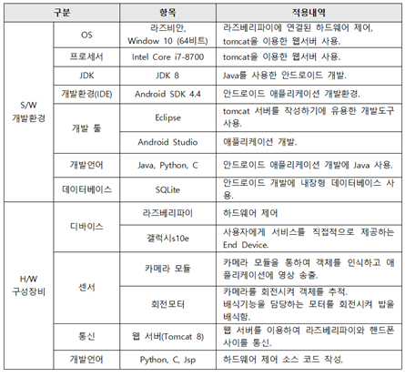
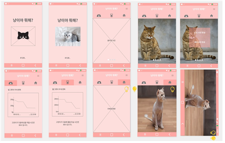
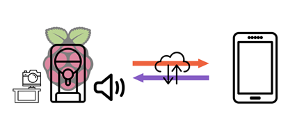
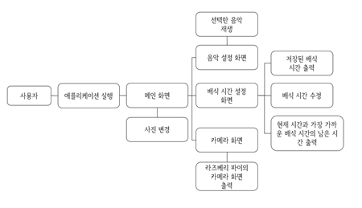
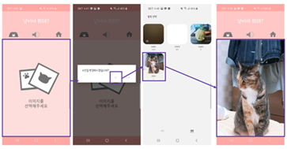
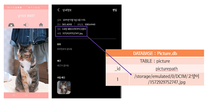
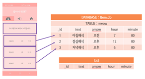
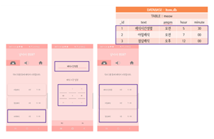
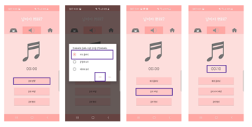
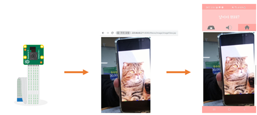

# 냥이야 뭐해?

홈 CCTV 애플리케이션

# 프로젝트 개요

우리는 반려동물 생활 인구가 1000만 명에 달하는 시대를 살고 있다. 특히 반려동물과 함께 사는 1인 가구가 꾸준히 늘어나면서 반려동물을 혼자 두는 문제가 발생하고 있다. 2019년에 서울시에서 제공한 '서울시민 반려동물 보유실태 및 인식 조사' 결과에 따르면, 2018년에 반려동물을 키우는 가구의 비율은 2017년 대비 0.6%포인트 상승하여 20%를 기록했으며, 2014년 이후부터 꾸준한 증가 추세를 보이고 있다.
하지만, 조사 결과에 따르면 반려동물을 키울 때 가장 어려운 점으로 '혼자 두고 외출이 어렵다'는 응답이 가장 높은 비율을 차지하고 있다(55.1%). 우리는 해당 문제를 해결하고 밖에서도 반려동물을 돌보기 위한 시스템을 제안한다.
조사 결과에 따르면, 반려견은 가구원수에 관계없이 유사한 비율을 보이지만, 반려묘는 1인 가구에서 키우는 비율이 높기 때문에 해당 시스템의 디자인은 주로 고양이를 고려하여 제작되었다. 이를 통해 1인 가구를 위한 특화된 서비스를 제공할 수 있다.

# 프로젝트 목표

- 반려동물을 혼자 두고 외출하는 문제를 해결하기 위한 시스템을 제안.
- 홈 CCTV와 배식 기능을 합친 제품을 제작하여, 금전적 문제를 줄이고 여러 제품을 이용하는 번거로움을 해소시킴.
- 해당 제품과 애플리케이션의 보급으로, 집에 혼자 있을 반려동물에 대한 걱정을 줄이고 집에 혼자 있는 반려동물의 불안감을 해소시킴.

# 프로젝트 일정
 - 2019.03 ~ 2019.11
 - 매주 월요일 13시 회의

 - [프로젝트일정](./meow_images/calendar.png)

# 팀원 소개

| **팀원** | **역할** |
|---------------|---------------|
| 김민성(팀장) | 서버 담당. http 기반의 jsp 개발 |
| 양규범 | 하드웨어 설계 |
| 이채원 | 객체 탐지. 카메라 스트리밍 |
| 조예림 | 애플리케이션 개발 |

# 개발 환경

# 스토리보드

# 시스템 전체 구성도

- 해당 시스템은 서버를 통해 밥그릇에 부착된 라즈베리 파이와 애플리케이션이 데이터를 주고 받음.
- 밥그릇에는 하드웨어를 제어해주는 라즈베리 파이, 사진을 찍는 카메라, 카메라를 회전시키기 위한 회전 모터, 배식을 담당하는 레버를 회전시키기 위한 회전 모터, 음악을 송출해주는 스피커가 부착되어 있음.
- 카메라로 1초마다 사진을 찍은 후 YOLO를 이용한 객체인식을 진행. 객체인식이 된 중심 좌표가 이미지 크기의 1/4지점이 넘으면 모터를 회전시켜 추적. 객체인식을 이용하여 반려동물이 위치한 좌표 값을 받아와 반려동물이 카메라의 중앙에 위치할 수 있도록 모터를 회전시킴.
- 서버는 밥그릇에 부착된 카메라의 연속적인 촬영 사진을 애플리케이션으로 전송. 애플리케이션에서 설정한 배식 시간과 현재 시간이 일치하는지 확인하여 자동으로 배식. 선택한 음악을 스피커로 송출.
- 사용자는 애플리케이션을 이용하여 사용자가 밖에서도 반려동물의 배식 시간을 설정해주거나, 반려동물에게 음악을 들려주고, 카메라 속 반려동물의 모습을 확인할 수 있음.
- 이러한 시스템을 통하여 사용자가 집이 아닌 밖에서도 반려동물을 케어할 수 있음.

# 애플리케이션 흐름도

# 프로젝트 기능
1. S/W
  - 클라우드 서버를 이용한 데이터 처리: 카메라 모듈에서 받아온 사진과 앱에서 받아온 시간 데이터 등을 클라우드 서버에서 저장하고 분석.
  - 실시간 영상 스트리밍: 실시간 스트리밍을 이용하여 애플리케이션에서 반려동물의 모습을 확인.
  - 사진 선택: 갤러리에서 선택된 사진으로 메인 화면의 사진이 변경됨.
  - 자동 배식 예약 기능: 아침, 점심, 저녁 배식 시간을 설정할 수 있음. 설정한 시간이 되면 자동으로 모터가 회전하며 밥그릇에 자동으로 밥을 배식해줌.
  - 음악 송출 기능: 반려동물에게 들려주고 싶은 음악을 선택하여 밥그릇의 스피커로 음악을 송출시킴.
  - 객체 탐지 및 추적 기능: YOLO를 이용한 객체인식을 이용하여 1초마다 사진을 찍고 인식된 중심 좌표가 이미지 크기의 1/4 지점이 넘어가게 되면 객체를 추적함.

2. H/W
  - 라즈베리파이: 하드웨어들을 제어하여 제 기능을 수행하도록 함.
  - 카메라: 실시간으로 카메라의 화면을 송출.
  - 회전 모터: 카메라를 회전시켜 객체를 추적하고, 배식 기능을 담당하는 모터를 회전시킴.
  - 스피커: 음악 송출.

# 화면 구현
1. 메인 화면
  - 파일의 액세스 권한이 허용되면 사용자의 갤러리에서 사진을 받아올 수 있으며, 이미지 파일의 경로를 담을 데이터베이스가 생성됨.
  - SQLite 이용. 애플리케이션을 재실행하더라도 선택한 이미지가 메인에 나타남.

  
2. 배식 시간 설정
  - 리스트를 이용. 데이터베이스에 저장된 텍스트와 배식 시간을 수정할 수 있음.
  - 버블 정렬을 이용하여 시간 순으로 정렬.
  - 현재 시간과 다음 배식 시간을 비교하여 남은 시간을 출력해 사용자의 편의성을 더함.

  
3. 음악 송출
  - 음악을 선택하여 스피커에 송출.

4. 카메라 CCTV
  - 서버와의 연동을 통해 전송받은 카메라의 화면을 출력.
  - 애플리케이션을 이용하여 카메라 속 모습을 실시간으로 확인할 수 있음.

# 기대효과
 - 반려묘 외에도 강아지나 페럿 등 여러 반려동물도 이용 가능.
 - 집에 반려동물이 혼자 있는 시간이 많아 걱정되는 사람들의 불안감을 감소시킴.
 - 실시간으로 일어나는 위급상황에 대처 가.

# 자체 평가

 - 학교 네트워크에서 FTP 오류, 웹 서버에서 카메라의 영상을 빠르게 받아올 수 없는 속도 문제가 나타남. 이를 통해, 시스템이 다양한 네트워크에서 잘 작동하는지 테스트해야 한다는 중요한 교훈을 얻음.
 - 구현한 기능들의 필요성을 평가하기 위해, 실제로 사용해보면서 효율성 검증이 필요함.
 - 앞으로 반려동물에게 필요한 기능들을 중점적으로 고려하여 제품을 완성할 예정.

# 수상 내역
2019.11.21 교내 캡스톤 경진대회 우수상

# 시연 영상

[시연영상](https://www.youtube.com/watch?v=qw1U5Td58qY)
